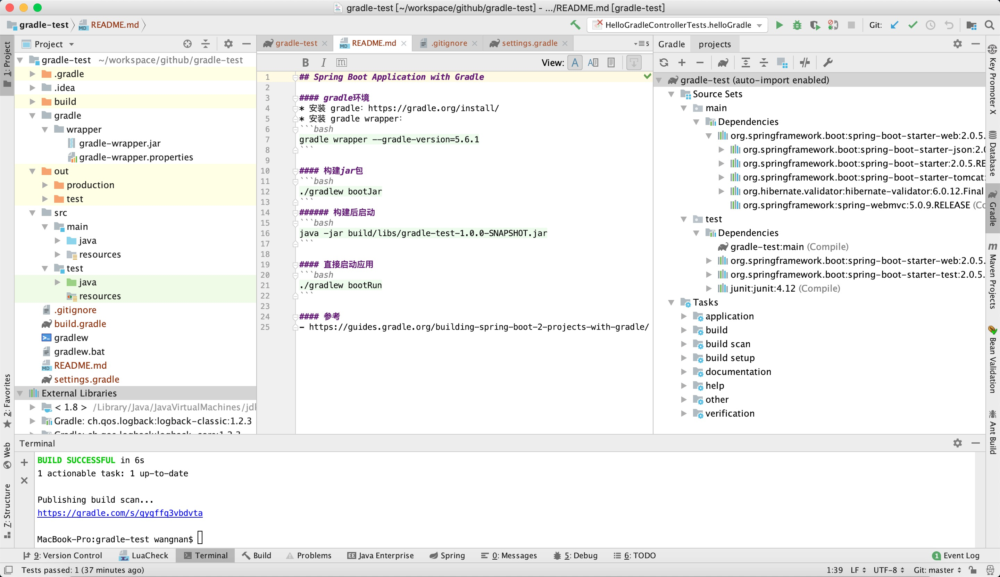

## Spring Boot Application with Gradle

#### gradle环境
* 安装 gradle：https://gradle.org/install/
* 安装 gradle wrapper（gradle 版本管理）：
```bash
gradle wrapper --gradle-version=5.6.1
```

#### 构建jar包
```bash
./gradlew bootJar
```
###### 构建后启动
```bash
java -jar build/libs/gradle-test-1.0.0-SNAPSHOT.jar
```

#### 直接启动应用
```bash
./gradlew bootRun
```

#### 项目结构


#### 参考
- https://guides.gradle.org/building-spring-boot-2-projects-with-gradle/